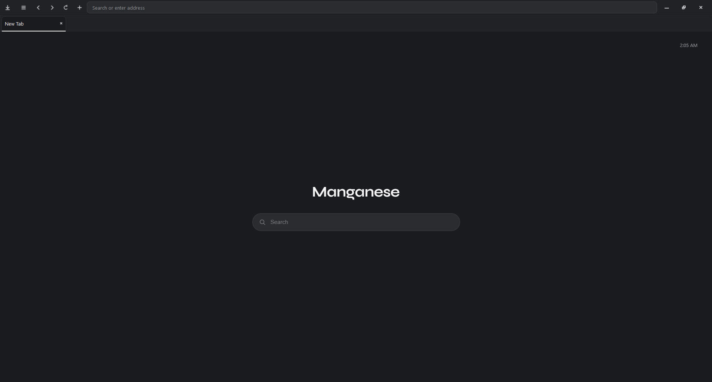
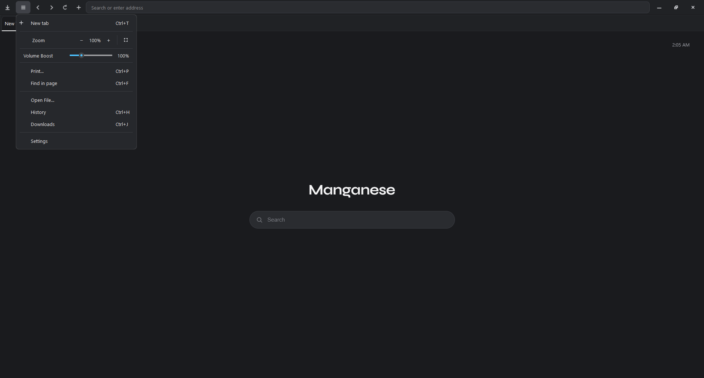
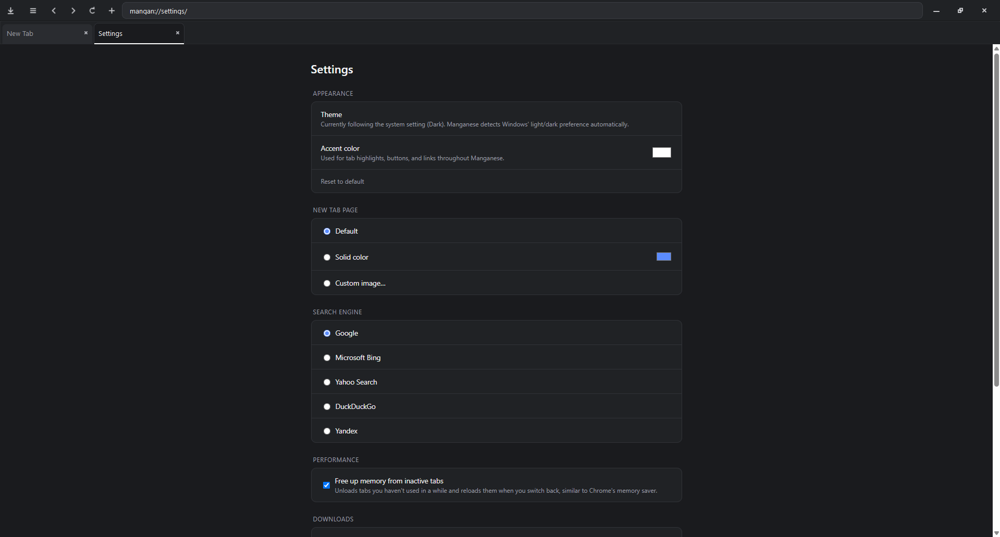

known bugs: uninstall doesnt work, if you want to uninstall it, delete the folder itself







# Manganese
a Chromium-based (QtWebEngine) desktop browser for Windows.

[Download the installer](https://github.com/Coffytea/cryxcrax-manganese/releases/tag/mainrelease)

## running from source
```
pip install -r requirements.txt
python -m manganese
```
or, after `pip install .`:
```
manganese
```
## features
- tabbed browsing with native Win32 DWM API
- tab detach/reattach into separate windows 
- cookie persistence across restarts (named, on-disk
  QWebEngineProfile, not the off-the-record default)
- Chrome-style browsing history, stored in `history.csv` under
  `%LOCALAPPDATA%\Manganese`, with per-entry and "delete all" controls
- cookies/site-data browser under Settings, with per-site and "clear all"
  deletion
- customizable accent color and New Tab page background (solid color or
  image)
- background tab suspension to reduce memory use, toggle in Settings
- find in page, DevTools, download manager, zoom, print

## building the installer

the installer is a separate PyQt6 app (`installer/installer_app.py`) that
bundles the built browser and installs it with Start Menu/Desktop
shortcuts, an Add/Remove Programs entry, and (optionally) registers
Manganese as a Windows-recognized browser under
`HKLM\Software\Clients\StartMenuInternet` + `Capabilities` +
`RegisteredApplications` (see `installer/win_registration.py`).

on Windows:

```
pip install -r requirements.txt
pip install -r installer/requirements.txt
```

```
python build.py
```
this produces `dist/installer/` containing `Manganese Setup.exe`,
`assets/`, and `payload/` (the built browser), ship that whole folder.

running `Manganese Setup.exe --uninstall` (or the `UninstallString` it
registers in Add/Remove Programs) removes everything it installed. <----- this aint working

## package layout

```
manganese/
├── __init__.py
├── __main__.py
├── app.py
├── platform_win32.py
├── theming.py
├── window.py
├── downloads.py
├── history.py
├── prefs.py
├── cookies.py
├── paths.py
├── shortcuts.py
├── tab_suspension.py
├── window_registry.py
├── url_scheme.py
├── shared_profile.py
├── pages/
│   ├── __init__.py
│   ├── new_tab.py
│   └── internal_pages.py
└── widgets/
    ├── __init__.py
    ├── tab_title.py
    ├── find_bar.py
    ├── draggable.py
    └── browser_view.py

installer/
├── installer_app.py
├── install_logic.py
├── win_registration.py
├── uninstaller.py
└── assets/

build.py
```

## Notes

- this app is Windows-only
- uninstalling does **not** delete `%LOCALAPPDATA%\Manganese` (history,
  cookies, prefs) by default, pass `--purge-data` to the uninstaller to
  remove that too. <------- uninstall aint even working rn
